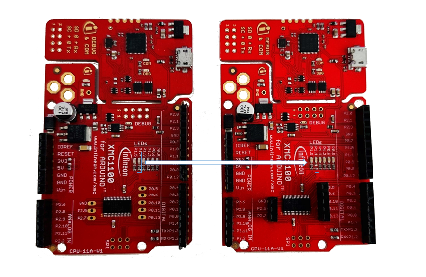
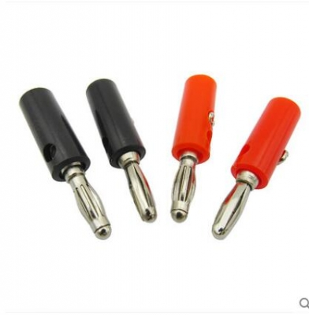
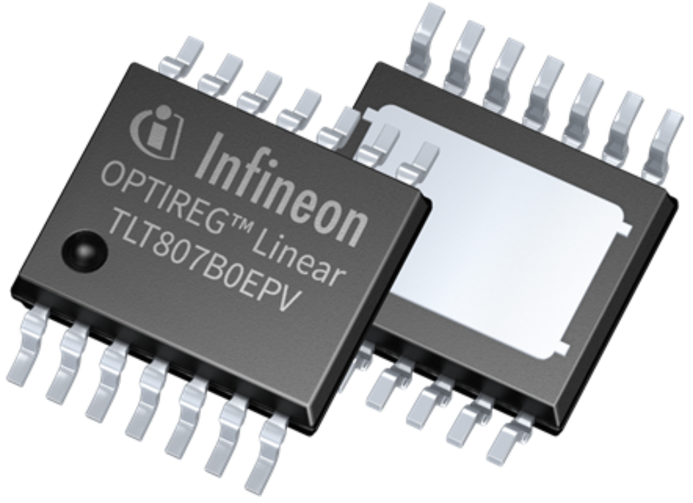
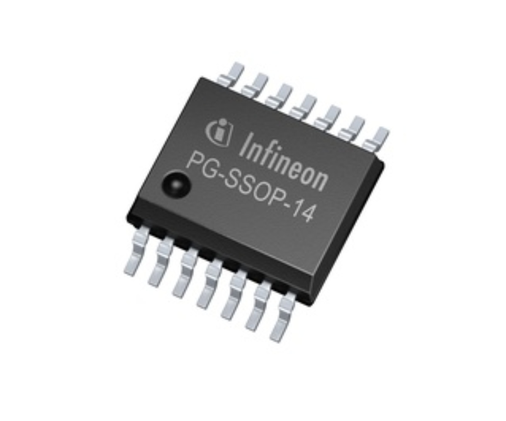
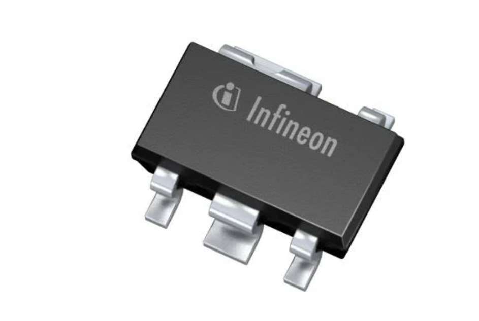
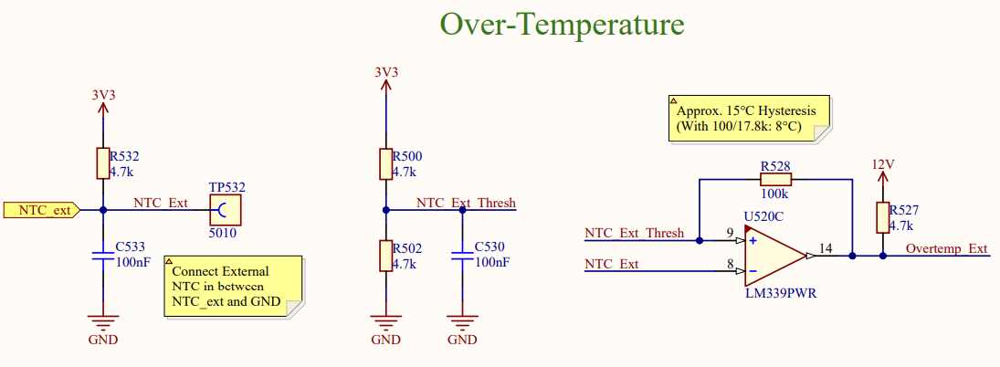
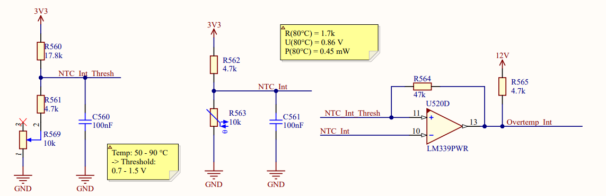
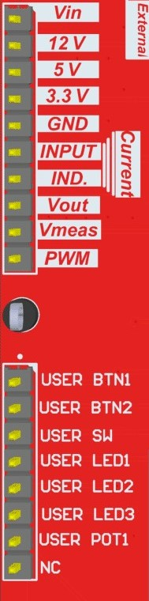

# Learning Platform for Switching Regulators


<p align="center">
  
</p>

This platform is designed with the intention of providing an interactive educational opertunity to university students with diverse technical backgrounds on switching regulators (namely buck converters). The project aims to develop the students' skills on using basic microcontroller IO features as starters and then build upon those skills to use a gate driver to implement a buck converter and monitor its output and efficiency. Along the Buck converter design process, the students get to use the the on board's peripherals to understand the different properties of buck converters and how they could be optimized. 

## Project's History
The project was introduced as a bachelor thesis of **Lukas Wiegert**. (*version 1.0*). Continued and further developed by **Adrian Keil** (*Versions: 1.0 ,1.1 ,1.2*) and finalized by **Youssef Tarkhan** (*versions: 2.1, 2.2*). The boards are used by the Technical University of Munich to teach the students and assess the quality and functionality of these boards and provide an open source curriculum.
# Board Breakdown

<p align="center">
  
</p>

**Brief summary**: As you can see from the block diagram, the board needs an input connection. (Bannana ports are provided at the bottom side of the board in version 2.2).  After the board makes sure that the polarity and the voltage are in check, the power is fed into the board's internal powersupply compartment. If the voltage level is below 10V then you will observe the undervoltage LED glowing in RED. The powerline feeding the whole board interfaces two optional possibilities for input current measurement. Power is then fed onto the power stage which consists of the components needed for the buck switching with a **VOut** output (*In older versions of the board there used to be additional banana ports for the **Vout** terminal and an additional ground banana port*.) Power is additionally fed into the arduino peripherals for basic microcontroller usage (LEDS, Switches, Buttons and Potentiometers). 

*Note that for every measurable quantity such as the input current for instance, there is a testpoint that could be attached onto an oscilloscope in order to have an easier experience when trying the measure this quantity*

# Microcontroller Pinouts
This platform is an arduino compatable shield. It is intended to be used in combination with the XMC1100 Bootkit
The labelling of the XMC1100 Bootkit pins is placed on the bottom layer's silk screen.

>An Arduino compatible shield is a hardware expansion board that is designed to be compatible with Arduino microcontroller boards. It is called a "shield" because it typically attaches on top of an Arduino board, extending its capabilities and providing additional functionalities

<p align="center">
  
</p>

<center>

## XMC 1100 Bootkit Pins
| Pin   | Net                   | Type   | Description                                |
|-------|-----------------------|--------|--------------------------------------------|
| A0    | In_Curr_ADC           | Input  | Analog input for current measurement        |
| A1    | Inductor_Current_ADC  | Input  | Analog input for inductor current sensing   |
| A2    | UserPot1              | Input  | Analog input for user potentiometer 1       |
| A3    | Vin_Meas              | Input  | Analog input for voltage measurement        |
| A4    | Vout_Meas             | Input  | Analog input for output voltage measurement |
| A5    | NTC_ext               | Input  | Analog input for external NTC temperature    |
| D0    | NC                    | NC     | Not connected                              |
| D1    | NC                    | NC     | Not connected                              |
| D2    | UserBtn1              | Input  | Digital input for user button 1             |
| D3    | Cntrl1                | Output | Digital output for control signal 1         |
| D4    | Cntrl2                | Output | Digital output for control signal 2         |
| D5    | Cntrl3                | Output | Digital output for control signal 3         |
| D6    | Buck_Cntrl_Arduino    | Output | Digital output for Arduino buck control     |
| D7    | UserBtn2              | Input  | Digital input for user button 2             |
| D8    | Shutdown              | Input  | Digital input for shutdown signal           |
| D9    | User_LED1             | Output | Digital output for user LED 1               |
| D10   | User_LED2             | Output | Digital output for user LED 2               |
| D11   | User_LED3             | Output | Digital output for user LED 3               |
| D12   | UserSw                | Input  | Digital input for user switch               |
| D13   | User_LED4             | Output | Digital output for user LED 4               |

<br><br>
</center>

> **Note:** The following code snippet defines all the required arduino pins for using the platform, simply copy it to the beginning of your code (before the setup)

<br><br>
<center>


```cpp
// Define all Arduino pins
// Digital Out
#define USER_LED1     9
#define USER_LED2     10
#define USER_LED3     11
#define USER_LED4     13
#define BUCK_PIN      6

// Digital In
#define USER_BTN1     2
#define USER_BTN2     7
#define SHUTDOWN      8
#define USER_SW       12

// Analog In
#define IN_CURR       A0
#define INDUCTOR_CURR A1
#define USER_POTI     A2

#define VIN_MEAS      A3
#define VOUT_MEAS     A4
#define NTC           A5

```

</center>
<br>
<br>
Also add the following pin setup lines into your setup loop 

<center>

```cpp
  pinMode(BUCK_PIN, OUTPUT);
  pinMode(USER_LED1, OUTPUT);
  pinMode(USER_LED2, OUTPUT);
  pinMode(USER_LED3, OUTPUT);
  pinMode(USER_LED4, OUTPUT);
  pinMode(USER_BTN1, INPUT);
  pinMode(USER_BTN2, INPUT);
  pinMode(USER_SW, INPUT);
  pinMode(SHUTDOWN,INPUT);
  pinMode(USER_POTI,INPUT);
  pinMode(INDUCTOR_CURR,INPUT);
  pinMode(IN_CURR,INPUT);

```

</center>
<br>
<br>


> **Note:** In order to use both user buttons you'll have to unsolder the resistor at Pin 1.4 (check out the diagram below)


<p align="center">
  
</p>

# Board Peripherals
As previously mentioned, what makes the board special is all the bells and whistles it comes with. 


# Power Input
The board is equipped with a variety of safety measures to ensure that it not only has a long life, but also ensure that students get to have a higher level of freedom with it. The board is to be powered with a DC power supply through banana plugs. 


<p align="center">
  
</p>

- First stage of the power input is going through the reverse polarity protection circuit, following by over voltage detection circuit. ( In case of an overvoltage detection, power is cut from the main circuit through a MOSFET) Note that the board supports up to 30V but has a recommended to be used in the 15V input range
- Voltage is then delivered to the board compartments : Powersupply, Safety Comparator, Powerstage stage & Miscellaneous  

  


# Power Supply
The Optimum input Voltage for the board input is around **15V**. In case the voltage goes over 19V the board goes into a hysterisis where it only gets back in operation when the voltage level goes below ****. Feel free to check the simulation files if you want to get a deeper insight into how the hysterisis works on a circuit design level. (You will have to install the spice model files for the ATL431, [click here](https://www.youtube.com/watch?v=EwAxUvS5z-0) for a guide on how to do that)
Along with the input being fed into the board, the board additionally has 3 additional power components which are:
<center>

 **12V LDO**: 
<p align="center">
  <a href="https://www.infineon.com/cms/de/product/power/linear-voltage-regulator/linear-voltage-regulators-for-automotive-applications/tlt807b0epv/">
    
  </a>
</p>
	- Gate driver IC
	- Input Internal Current Sense Amplifier
	- Safety Latch 
	- Safety Circuit Comparator
	- Safety LEDs
			


**5V Buck**: 
<p align="center">
  <a href="https://www.infineon.com/cms/de/product/power/dc-dc-converters/switching-regulators/optireg-switchers-automotive/tlf50211el/">
    
  </a>
</p>
	- 3V3 LDO
	- Arduino Compatable MCU 
	- Safety Circuitry Voltage Threshhold (*Under-Voltage Detection*)
  
**3V3 LDO**:
<p align="center">
  <a href="https://www.infineon.com/cms/de/product/power/linear-voltage-regulator/linear-voltage-regulators-for-automotive-applications/tle4295g-v33/">
    
  </a>
</p>
	- Output Internal Current Sense Amplifier
	- ADC Compensation for MCU Input
	- Safety Comparator Circuit
</center>		

<br><br>

## Safety
The safety compartment of the board is comprised mainly of a comparator and a safety latch, where when the safety comparator detects a flag, this flag is saved on the latch. (To reset the latch all you'll have to do is press the latch reset button)

**Flags**

When safety flags are triggered, a **shutdown** signal is generated and the corresponding flag's LED is lit. The **shutdown** signal is delivered to the microcontroller and the power stage components. The powerstage is disabled as long as the shutdown signal is being delivered to its components.  


- Overcurrent
  - The output current from the powerstage is measured over a shuntresistor and a current sense amplifier. The output signal is then fed into a the safety comparator, which is compared to a constant reference voltage. (This reference voltage is equal to the corresponding output of the amplifier when the output current is around **2.8A**). 
  	<p align="center">
	
	</p>

- Undervoltage
  - the input voltage is fed through the two equal value resistors R510 and R511 and the signal is halfed (voltage divider Law), and is then fed into the comparator. As reference the 5V Buck output is fed into the other input of the comparator. If the input voltage goes below 10V , then half of that signal will be lower than 5V and so the undervoltage flag would be triggered.
  <p align="center">
	
	</p>

	
- Overtemperature (External)
  - An NTC is connected on the external resistor board. (Negative Thermal cooefficient resistor; pretty much a fancy word for a resistor, who's resistance value changes when its temperature changes). The NTC's signal is connected to an input of the safety comparator with a reference signal connected to the other input.
    <p align="center">
	
	</p>
- Overtemperature (Internal)
  - Similar to external overtemperature detection, however the NTC is onboard and there is a variable resisotr on board to calibrate the onboard overtemperature limit of the board. 
<p align="center">
	
	</p>


- Safety LEDs
  - you can find the safety LEDs are placed on the top right corner of the PCB
<p align="center">
	
	</p>

<br><br>
## Miscellaneous
The board is equipped with:
- 1 User programmable potentiometer
  
- 2 User programmable buttons
  
- 4 User programmable LEDs

- 1 User programmable Switch
  

<br>

##  Buck Operation
The buck operation takes place over a gate driver; what happens: is that the gate driver takes in pulse width modulated signals from the microcontroller (XMC 1100 Bootkit) or an external controller through the **PWM** pin on the external control pin header.  The users have to modify the **BUCK CNTRL** switch to adapt the circuitry to whether or not the control signal would be coming from the external control pin header or through the onboard controller pins(*XMC1100 Bootkit*). The students get to change the frequency and duty cycle of the signal in order to achieve their desired output voltage. 


## External Control

Aside from using the board as a shield, it could also just be connected to an external controller circuit.


<p align="center">
	
	</p>

As shown in the diagram above, using jumper cables, the user externally has access to: 

- Input voltage to through the Banana cables
- 12V Output of the LDO
- 5V Output of the Buck Controller
- 3.3V Output of the LDO
- Input Current Sensor Reading
- Output Current Sensor Reading
- Output Voltage 
- Output Voltage (Calibrated to 0 to 5V)
- External Buck Control
- User Button 1 Input
- User Button 2 Input
- User Switch Input
- User LEDs (1 to 3)
- User Potentiometer 1 Input


### NTC Calibration
- For making sure that the temperature on board is in check, negative thermal coefficient resistors are chosen . The onboard maximum temperature could easily be calibrated by adjusting a potentiometer for temperature limitation between (50°C and 90°C)


## Current Measurement
The main method of current measurement is the combination of a shunt resistor and a current sense amplifier. This setup is repeated in the input and output current measurement system. The operation relies on a voltage drop accross the shunt resistor proportional to the current flowing through it. This voltage drop is amplified by the current sense amplifier into a new voltage value. This voltage value is read by the micro-controller's ADC and it's used to subsequently calculate the value of the current.


<br>

# Simulation Files
To provide a rich experience to students, the simulation files for most of the building blocks of the learning platform are provided. These simulations are accessable of LTSPICE, which is an open source freeware, that is very popular in the industry.  

You can find these simulations under the Directory /Simulations.
<br>


# Future Strategy 
This project is not yet fully disclosed, and it will remain under  development so feel free to reach out to youssef.tarkhan@infineon.com for any inquiries or suggestions anytime. 